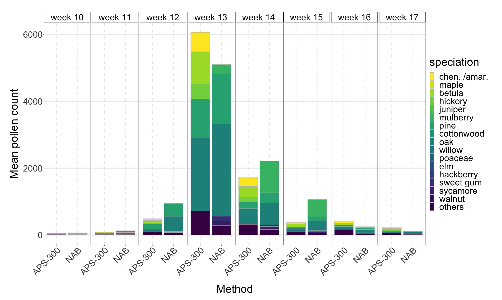

```{r}
renv::activate()
here::i_am('Rmd/report.Rmd')
```

In this analysis, we matched the pollen speciation names of the two devices of NAB and APS-300. Then we calculated the weekly pollen count of these devices through 2020. The two datasets was stored in the output directory for future analsyis. The firt 5 rows of those two datasets now reads:
```{r}
head(read.csv(here::here('output','APS_300_counts_by_week.csv')))
head(read.csv(here::here('output','NAB_counts_by_week.csv')))
```

We then compared the weekly pollen counts of each speciations measured by two different methods of 'NAB' and 'APS-300'. AS can be seen in the _fig 1_, both devices captured similar trends of pollen counts in the pollen peak weeks, while dominated species observed from two devices are different.

Here's my picture:

